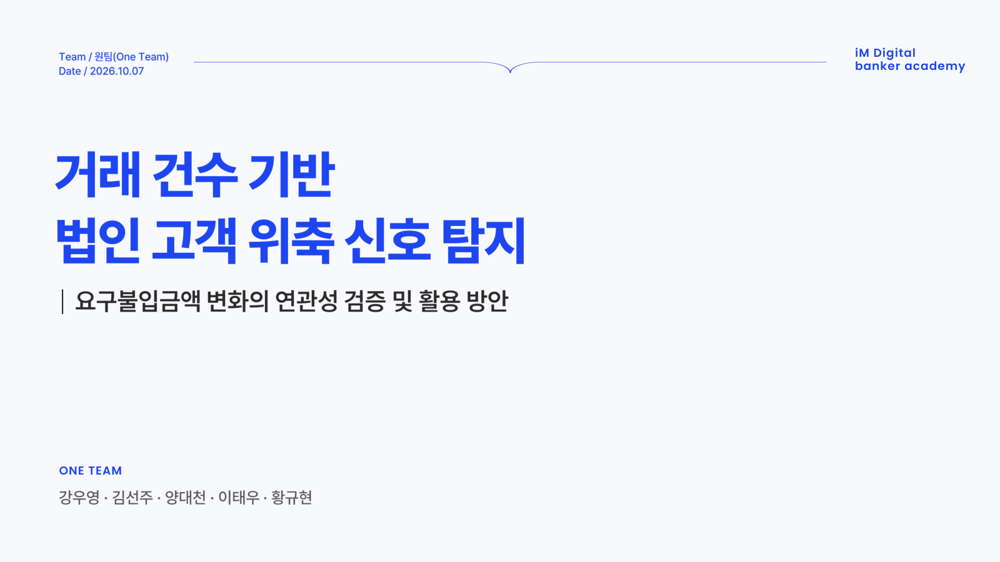
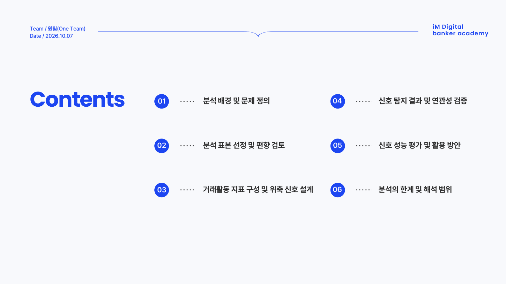
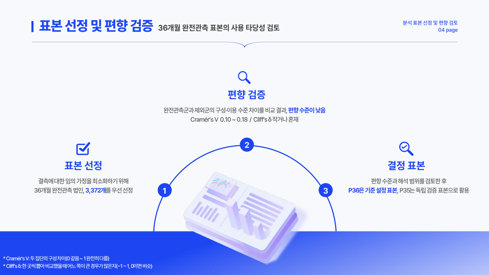
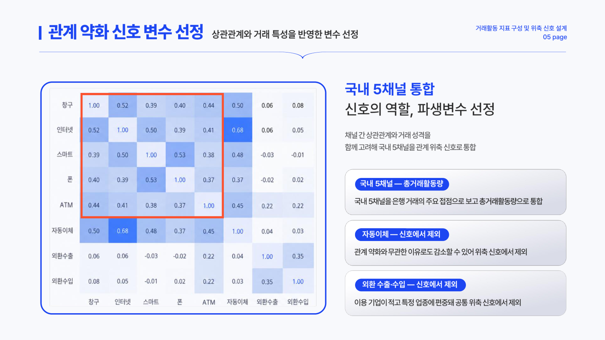
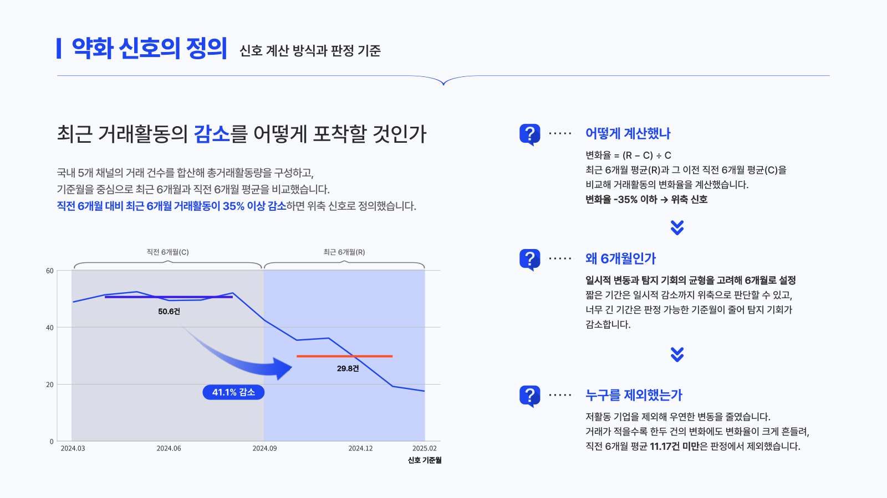
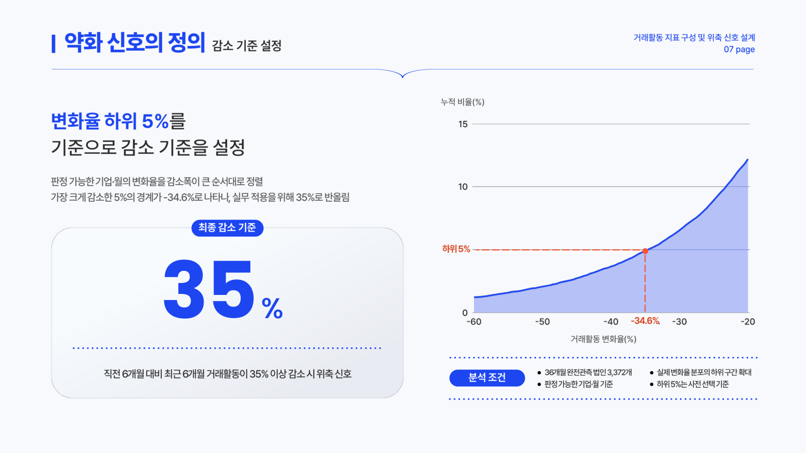
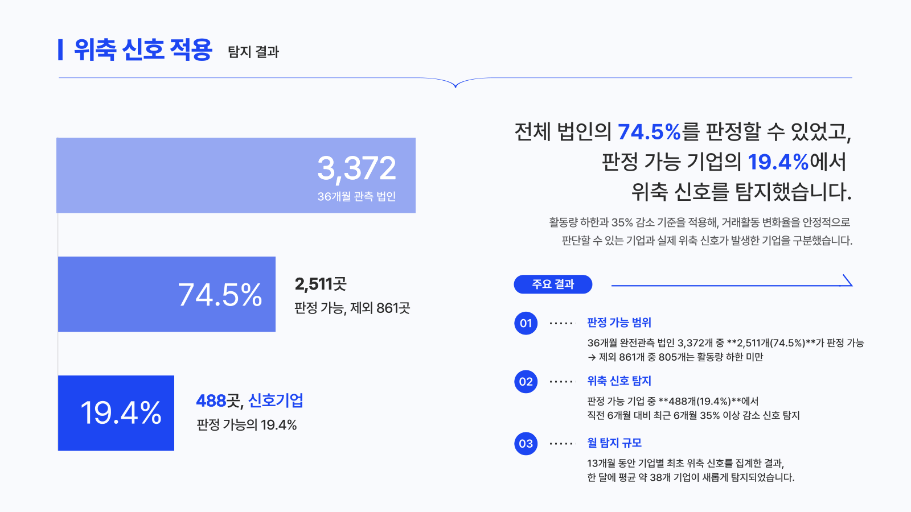

<div align="center">

# 📉 거래 건수 기반 법인고객 위축 신호 탐지

**요구불입금액 변화와의 연관성 검증 및 활용 방안**<br>
이탈을 계좌 해지가 아닌 거래 위축의 관점에서 본다


<br>


[팀](#-팀) · [프로젝트 개요](#-프로젝트-개요) · [발표자료](#-발표자료) · [폴더 구조](#-폴더-구조) · [팀 규칙](#-팀-규칙)

</div>

## 👥 팀

<table>
  <tr>
    <td align="center" valign="top" width="150"><a href="https://github.com/2wooyeong2"><br><b>강우영</b></a><br><sub>프로젝트 총괄<br>보고서 작성·관리</sub></td>
    <td align="center" valign="top" width="150"><a href="https://github.com/Thunju"><br><b>김선주</b></a><br><sub>데이터 시각화<br>발표자료 디자인</sub></td>
    <td align="center" valign="top" width="150"><a href="https://github.com/BigskyYang"><br><b>양대천</b></a><br><sub>분석 기획<br>위축 지표 설계</sub></td>
    <td align="center" valign="top" width="150"><a href="https://github.com/leetaewoo-98"><br><b>이태우</b></a><br><sub>선행 분석 검토<br>탐색적 데이터 분석</sub></td>
    <td align="center" valign="top" width="150"><a href="https://github.com/hkyuhyun"><br><b>황규현</b></a><br><sub>데이터 전처리<br>표본 편향 검증</sub></td>
  </tr>
</table>

## 📌 프로젝트 개요

<table>
  <tr><th width="90">구분</th><th>내용</th></tr>
  <tr><td align="center" width="90"><b>배경</b></td><td>법인고객은 계좌를 유지한 채 거래 일부를 줄이거나 다른 은행으로 나눌 수 있어, 계좌 해지 여부만으로는 관계 약화를 알기 어렵다</td></tr>
  <tr><td align="center" width="90"><b>질문</b></td><td>거래 건수가 직전 6개월보다 크게 줄어든 법인은, 조건이 비슷한 비교 법인보다 이후 6개월 동안 요구불입금액 약화가 더 자주 나타나는가? 그렇다면 이 신호를 상담 우선순위 선정에 어떻게 쓸 수 있는가?</td></tr>
  <tr><td align="center" width="90"><b>데이터</b></td><td>법인고객 월별 금융거래 데이터 (2023.01~2025.12, 36개월, 법인 × 월)</td></tr>
</table>

> 분석 방법과 결과는 아래 [발표자료](#-발표자료) 참고

## 🎞 발표자료

<!-- 발표자료 교체 방법: 슬라이드를 PNG(가로 1600px 정도)로 내보내 final/presentation/ 에 slide_01.png, slide_02.png … 로 덮어쓰고, 장 수가 바뀌면 아래 img 줄을 늘리거나 줄인다. -->

<p align="center">
  <br><br>
  <br><br>
  <br><br>
  <br><br>
  <br><br>
  <br><br>
  <br><br>
  <br><br>
</p>

## 🗂 폴더 구조

```
oneteam-project/
├── README.md
├── final/              최종 자료
│   └── presentation/   발표자료 슬라이드 이미지
├── analysis/           최종 분석 코드·노트북 (거래 건수 기반, 재현 방법은 analysis/README.md)
├── docs/               기획서, 일일 진행일지(daily_report/)
└── members/            팀원별 중간 자료·작업물
    ├── wooyeongkang/   강우영 — 총괄·보고서
    ├── seonjukim/      김선주 — 시각화·발표자료
    ├── yangdaecheon/   양대천 — 분석 기획·위축 지표 설계 (요구불입금 기반 이전 단계 기록)
    ├── leetaewoo/      이태우 — 선행 분석 검토·탐색적 분석
    └── hwangkyuhyun/   황규현 — 전처리·표본 편향 검증
```

각 폴더의 자세한 내용은 폴더 안 README를 본다.

## 📎 팀 규칙

<details>
<summary><b>데이터 취급 원칙</b></summary>

- **공유되면 안되는 데이터는 레포지토리 안에 넣지 않는다.** 폴더 밖에 보관하고 실행 시 경로를 인자로 전달한다.
- 데이터에서 파생된 산출물·보고서도 반출 전 검토가 필요하므로 기본 차단한다.
- 노트북은 실행 결과(출력)와 내 컴퓨터의 경로를 지운 뒤 올린다.
- AI 코딩 도구의 개인 설정·지침 파일(`.claude/`, `CLAUDE.md`, `AGENTS.md` 등)은 올리지 않는다 (`.gitignore` 처리).
- 커밋 전 올라갈 파일 목록을 눈으로 확인한다.

</details>

<details>
<summary><b>협업 규칙</b></summary>

- `main` 에 직접 푸시하지 않는다.
- 작업은 브랜치를 만들어서 진행한다.
  - `feat/` 새 분석·기능, `fix/` 수정, `docs/` 문서
  - 예) `feat/eda-소비패턴`, `fix/전처리-결측치`
- 작업 완료 후 Pull Request → 팀원 리뷰 → merge
- 커밋 메시지는 `유형: 내용` 형식으로 (`feat: 월별 거래액 집계 추가`)

</details>
