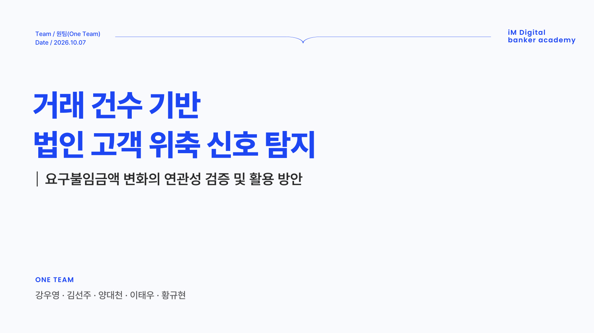
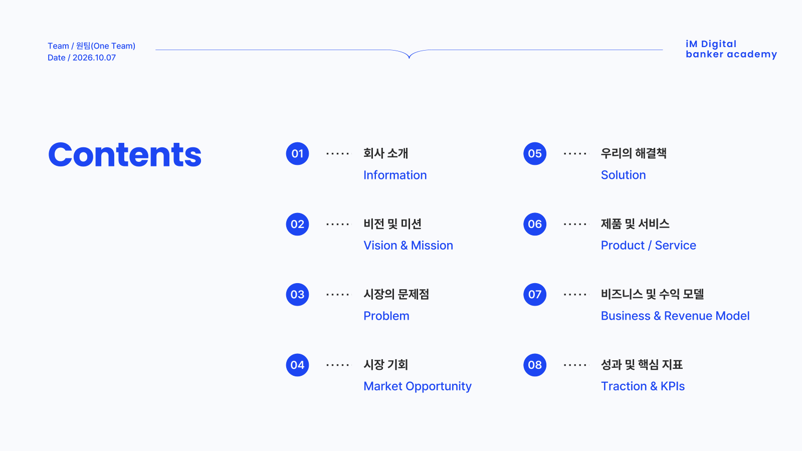
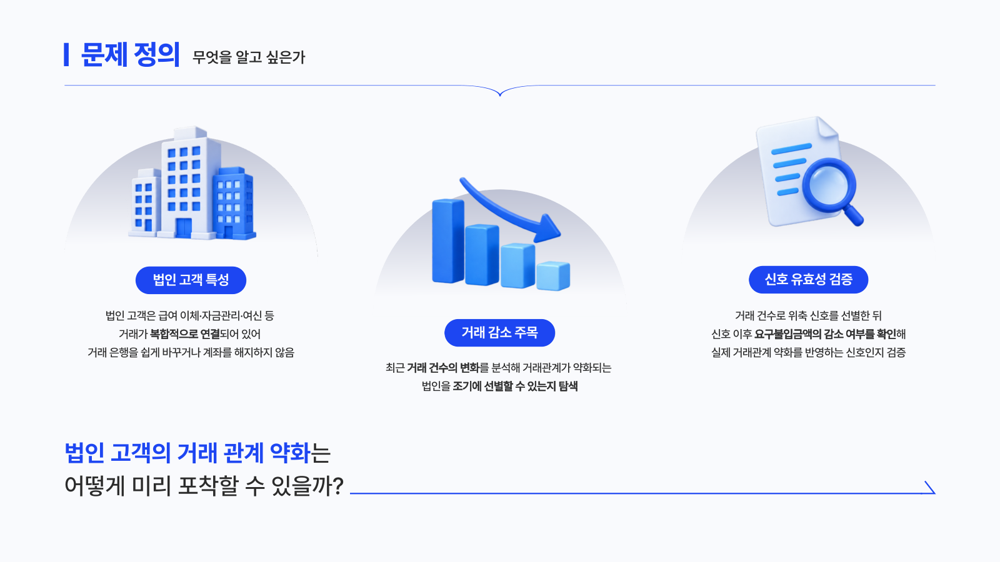

# 📉 거래 건수 기반 법인고객 위축 신호 탐지
> 요구불입금액 변화와의 연관성 검증 및 활용 방안 — 이탈을 계좌 해지가 아닌 거래 위축의 관점에서 본다

## 팀 정보

- **팀명**: 원팀(One Team)
- **기간**: 2026-09-21 ~ 2026-10-07
- **주제**: 거래 건수 기반 법인고객 위축 신호 탐지 — 요구불입금액 변화와의 연관성 검증 및 활용 방안을 중심으로

| 이름 | GitHub | 역할 |
|---|---|---|
| 강우영 | [@2wooyeong2](https://github.com/2wooyeong2) | 프로젝트 총괄, 보고서 작성·관리 |
| 김선주 | [@thunju](https://github.com/Thunju) | 데이터 시각화, 발표자료 디자인 |
| 양대천 | [@BigskyYang](https://github.com/BigskyYang) | 분석 기획, 위축 지표 설계 |
| 이태우 | [@leetaewoo-98](https://github.com/leetaewoo-98) | 선행 분석 검토, 탐색적 데이터 분석 |
| 황규현 | [@hkyuhyun](https://github.com/hkyuhyun) | 데이터 전처리, 표본 편향 검증 |

## 프로젝트 개요

**배경** — 법인고객은 계좌를 유지한 채 거래 일부를 줄이거나 다른 은행으로 나눌 수 있다. 계좌 해지 여부만으로는 이런 관계 약화를 알기 어렵다.

**문제 정의** — 거래 건수가 직전 6개월보다 크게 줄어든 법인은, 조건이 비슷한 비교 법인보다 이후 6개월 동안 요구불입금액 약화가 더 자주 나타나는가? 그렇다면 이 신호를 상담 우선순위 선정에 어떻게 쓸 수 있는가?

**데이터** — 법인고객 월별 금융거래 데이터 (2023.01~2025.12, 36개월, 법인 × 월). 원본은 반출 제한 자료라 이 레포에 없다.

**분석 흐름**

| 단계 | 내용 |
|---|---|
| ① 위축 신호 | 국내 5채널(창구·인터넷·스마트·폰·ATM) 거래 건수 합이 직전 6개월 대비 35% 이상 줄어든 최초 기준월 |
| ② 관계 위축(결과) | 신호 이후 6개월 요구불입금액이 작년 같은 달보다 크게 줄어듦 (전체 하위 5%) |
| ③ 비교 | 같은 기준월·거래량 5분위·업종 안에서 신호가 없던 기업과 비교 (층화 + 직접 표준화), 상대위험도(RR) |
| ④ 검증 | 기업 단위 군집 부트스트랩 95% 신뢰구간, 독립 표본(홀드아웃), Leave-one-out·분석 기준 20가지 민감도 분석 |

**핵심 결과**

- 신호 기업의 관계 위축 비율은 24.6%, 비교 기업은 5.3% → 상대위험도 **4.69** (95% 신뢰구간 3.75~5.95)
- 규칙에 쓰지 않은 기업(독립 검증) 4.29, 분석 기준 20가지 2.75~6.47로 모두 연관 유지
- 신호 기업 넷 중 셋은 관계 위축이 없고, 거래가 많은 기업은 신호가 드물다(사각지대). 인과나 조기경보가 아닌 **먼저 살펴볼 기업을 고르는 선별 기준**으로 쓴다

## 발표자료

> 최종 발표자료(PPT) 완성본을 이미지로 넣을 자리. 슬라이드를 PNG로 내보내 `docs/presentation/` 에 `slide_01.png`, `slide_02.png` … 로 저장한 뒤, 아래 주석(`<!--`, `-->`)을 지우고 장 수에 맞게 줄을 늘리거나 줄인다.

<!--
<p align="center">
  
  
  
</p>
-->

## 폴더 구조

```
oneteam-project/
├── README.md
├── docs/            팀 기획서 등 공동 문서
├── daily_report/    일일 진행일지
├── wooyeongkang/    강우영 — 총괄·보고서
├── seonjukim/       김선주 — 시각화·발표자료
├── yangdaecheon/    양대천 — 분석 기획·위축 지표 설계, 거래 건수 기반 분석 코드
│   └── 건수분석/     재현용 코드·노트북 (아래 '분석 재현' 참고)
├── leetaewoo/       이태우 — 선행 분석 검토·탐색적 분석
└── hwangkyuhyun/    황규현 — 전처리·표본 편향 검증
```

각 폴더의 자세한 내용은 폴더 안 README를 본다.

## 분석 재현

거래 건수 기반 분석은 원본 파일 경로만 넣으면 같은 코드·같은 난수 시드로 다시 계산할 수 있다.

```bash
cd yangdaecheon/건수분석
pip install -r requirements.txt
python run_all.py --data "레포 밖의 원본 파일 경로"
```

자세한 방법과 결과 점검표는 [yangdaecheon/건수분석/README.md](yangdaecheon/건수분석/README.md)에 있다. 원본 없이 코드만 확인하려면 `python tools/smoke_test.py`(합성 데이터)를 실행한다.

## 데이터 취급 원칙

- **공유되면 안되는 데이터는 레포지토리 안에 넣지 않는다.** 폴더 밖에 보관하고 실행 시 경로를 인자로 전달한다.
- 데이터에서 파생된 산출물·보고서도 반출 전 검토가 필요하므로 기본 차단한다.
- 노트북은 실행 결과(출력)와 내 컴퓨터의 경로를 지운 뒤 올린다.
- AI 코딩 도구의 개인 설정·지침 파일(`.claude/`, `CLAUDE.md`, `AGENTS.md` 등)은 올리지 않는다 (`.gitignore` 처리).
- 커밋 전 올라갈 파일 목록을 눈으로 확인한다.

## 협업 규칙

- `main` 에 직접 푸시하지 않는다.
- 작업은 브랜치를 만들어서 진행한다.
  - `feat/` 새 분석·기능, `fix/` 수정, `docs/` 문서
  - 예) `feat/eda-소비패턴`, `fix/전처리-결측치`
- 작업 완료 후 Pull Request → 팀원 리뷰 → merge
- 커밋 메시지는 `유형: 내용` 형식으로 (`feat: 월별 거래액 집계 추가`)
